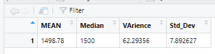

# MechaCar_Statistical_Analysis
## Background

A few weeks after starting his new role, Jeremy is approached by upper management about a special project. AutosRUs’ newest prototype, the MechaCar, is suffering from production troubles that are blocking the manufacturing team’s progress. AutosRUs’ upper management has called on Jeremy and the data analytics team to review the production data for insights that may help the manufacturing team.

### Deliverable 1:

Perform multiple linear regression analysis to identify which variables in the dataset predict the mpg of MechaCar prototypes

Q1) Which variables/coefficients provided a non-random amount of variance to the mpg values in the dataset?

- Methodology:Each Pr(>|t|) value in the summery represents the probability that each coefficient contributes a random amount of varience to the linier model.

- By using the dataset MechaCar_mpg dataset,we can say vehicle_length( p value -5.08e-08) and ground clearence (p value - 5.21e-08) have significant impact on mpg.

Q2) Is the slope of the linear model considered to be zero? Why or why not?

- There is significant relationship between independent variables (vehicle length,ground clearence) and the dependent variable (mpg),so the slope is not zero.

Q3) Does this linear model predict mpg of MechaCar prototypes effectively? Why or why not?

 - Methodology : Examin the Multiple R-squared value to indicate how well the regression model approximate real world data points.In most cases, the value will range between 0 and 1 and can be used as a probabilty metric to determine the likehood that future data points will fit the model.

 - According to the our summery table  Multiple R-squared valu is 0.7149,so it's greater than 0.7 ,and it means model does an sufficient juob of predicting mpg.

### Deliverable2:

Collect summary statistics on the pounds per square inch (PSI) of the suspension coils from the manufacturing lots

Q1)

The design specifications for the MechaCar suspension coils dictate that the variance of the suspension coils must not exceed 100 pounds per square inch. Does the current manufacturing data meet this design specification for all manufacturing lots in total and each lot individually? Why or why not?

Summerize table for All manufacturing lots:

- According to the above summerize for all manifacturing lots varience is 62.29356 is less than 100.

Summerize table for each manufacturing lot:

- Lot 1 and 2 with in design specifications but Lot 3 has varience exceeds specificatiob 100 PSI.
### Deliverable3:
Run t-tests to determine if the manufacturing lots are statistically different from the mean population

t-test results for All lots:

For all lots with p valuen-0.06 not significantly different from population mean

t-test results for Lot1:

Lot 1 with p-valu - 1 is not significantly different from population mean.

Lot 2 with p-valu - 0.6 is not significantly different from population mean.

Lot 3 with p-valu - 0.4 is  significantly different from population mean.

### Deliverable4:
Design a statistical study to compare vehicle performance of the MechaCar vehicles against vehicles from other manufacturers. For each statistical analysis, you’ll write a summary interpretation of the findings.

### The Statistical Analysis has following:

 - Metrics to be tested

 - Null hypothisis(H0) and Alternative Hypothisis(Ha)

 - Statistical tests using to test the Hypothisis

 This Study will collect data on MechaCar and vehicles from other compititor for last 3 years

 ####  Metrics to be tested

    - Horse power( break horsepower and wheell horsepower) - dependent variable

    - Number of cylynders - Independent variable

    - Temperature of combustion  - Independent variable

    - Speed of the engine. - Independent variable

    - Size of the cylinder  Independent variable

#### Null hypothisis(H0) and Alternative Hypothisis(Ha)

    H0 - MecharCar's performence (HorsePower) correctly based on key factors.

    Ha - Other Manifacturer's (HorsePower) correctly based on key factors. ???

#### statistical Tests

For this  staticle analysis the statistical test we would used is  Multiple linear regression.

In Multiple linear regression, we'll look at each independent variable to determine if there is a significant relationship with the dependent variable(Horse Power). Once we have evaluated each independent variable, we'll evaluate the r-squared value of the model to determine if the model sufficiently predicts our dependent variable.

Test  used to determine the factors that have the highest correlation with the performence  (dependent variable: Horse Power); which combination has the greatest impact on priceperformence.It can be two or three parameters or all of them.

